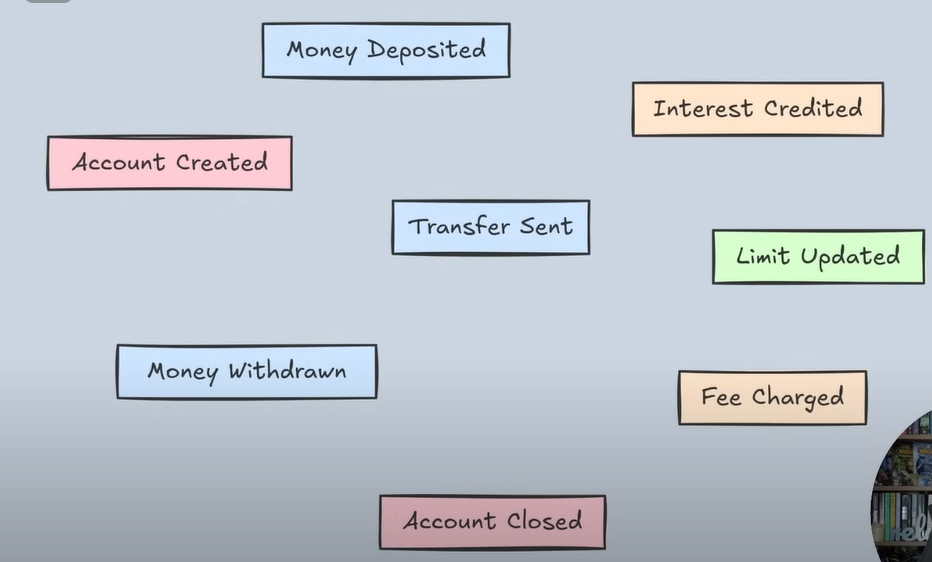
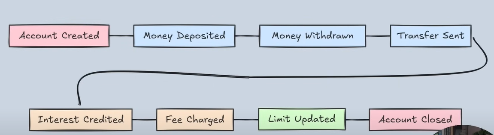
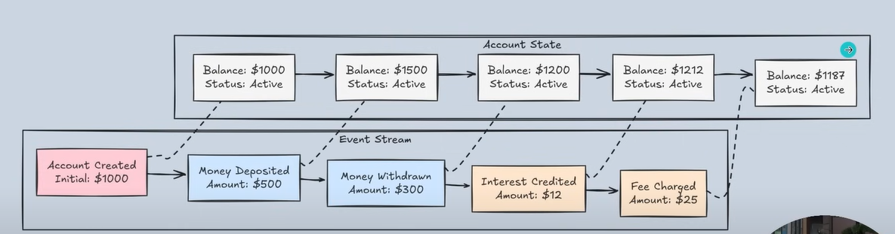
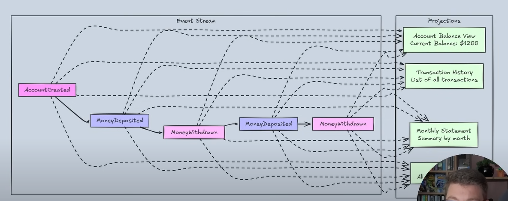
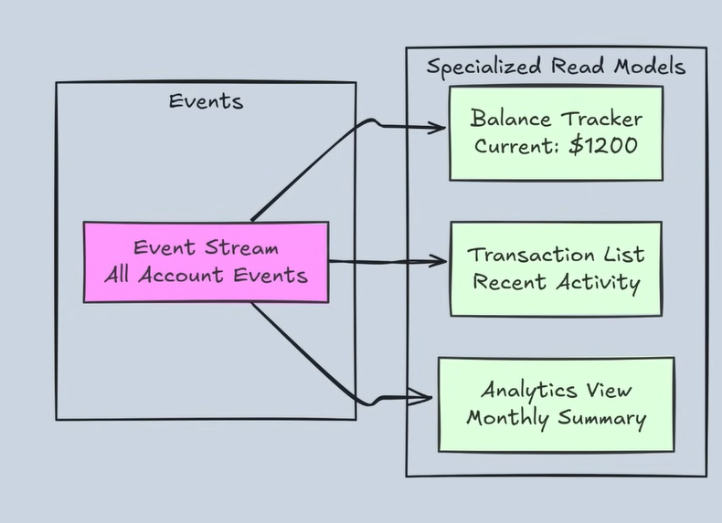
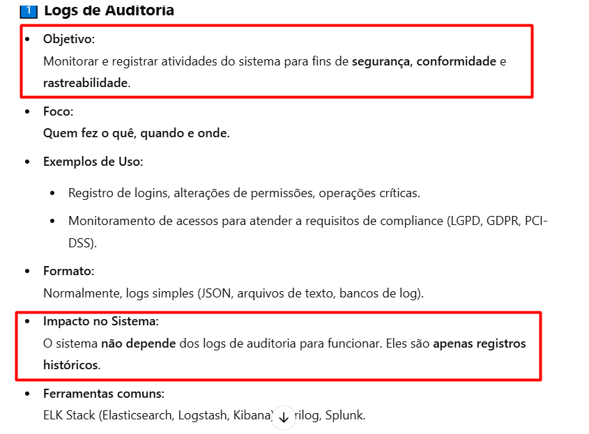
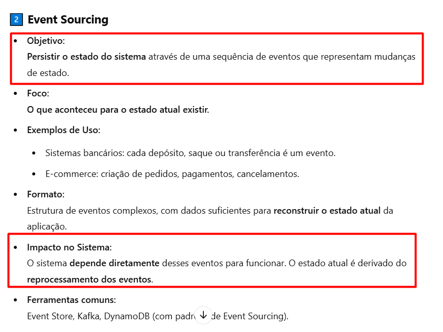

# Event Sourcing

Aprenda os fundamentos do Event Sourcing no .NET com este guia para iniciantes. Exploraremos como armazenar o estado do seu aplicativo como uma sequência de eventos em vez de apenas o estado atual. Começando com os conceitos principais, abordaremos a modelagem de eventos, a criação de agregados, a aplicação de eventos, a implementação de lógica de negócios e a construção de projeções para consultas eficientes. Perfeito para desenvolvedores .NET que buscam entender os padrões do Event Sourcing e sua implementação prática. Exemplos de código incluídos.

## O que é Event Sourcing

Event Sourcing é uma padrão de design de arquitetura do qual guardamos as mudanças de estado do nosso domínio através de eventos imutáveis dentro de uma stream append only log. Ou seja, é sobre persistir as mudanças de estado dos seus modelos de domínio numa série sequencial de eventos.

Alguns build blocks do Event Sourcing são:

### Events

Os eventos são fatos imutáveis que ocorreram no nosso domínio e com intenções do domínio. Exemplos de eventos na imagem abaixo:



### Streams

Stream de eventos, ou seja, um append only log de eventos para um determinado identificador do conjunto de eventos. Logo é o local onde guardamos os eventos de um determinada AGREGADO. Exemplo de uma Stream de eventos abaixo:



### State

Quando usamos event sourcing nós nunca guardamos o estado final (current state) do nosso domínio, e sim um conjunto de fatos que ocorreram (eventos) que representam o estado.
Para reconstruir o estado de um objeto do nosso domínio em um dado período do tempo para peformarmos operações (lógicas de negócio) nós precisamos de obter o stream de eventos e recalcularmos aplicando o replay dos eventos. Abaixo mostra exatamente o que foi falado anteriormente:



Note que foi obtida a stream dos eventos de um determinado objeto do domínio (identificador único) e feito o replay dos eventos dele para obter o estado corrente OU estado até um determinado ponto no tempo. 

### Projections

Ter que fazer o replay dos eventos toda vez para obter o estado corrente de um objeto do domínio ou estado até um determinado ponto pode ser muito mais muito custoso computacionalmente falando.
Para resolver este problema usamos as chamadas *Projections*, que nos permite criar as READ MODELS para guardando o estado em um determinado ponto desejado, sem precisar de ter que recalcular toda a stream de eventos.



Note na figura abaixo que a partir da stream de eventos armazenados podemos criar diferentes Read Models Views diferentes de acordo com as necessidades do negócio e do projeto, como por exemplo: uma view do tracker do saldo atual do cliente, lista de todas transações dos últimos 2 meses, atividades recentes, resumo mensal da conta do cliente e afins.



OBS.: Projections também podem ser chamadas de Read Models, View Models ou Query Models.

### Diferença de Logs de Auditoria para Event Sourcing

A diferença deles está principalmente **nas intenções que cada um tem dentro de um sistema**. Enquanto que os logs de auditoria se preocupa em trackear e saber quais são as atividades realizadas dentro de um sistema para fins de segurança, auditoria e rastreabilidade: 



O event sourcing foca literalmente em armazenar todas as mudanças de estado do sistema ao invés de só o estado final (corrente).



## Como executar?

Principal forma utilizada para executar a aplicação foi utilizando a [Visual Code](https://code.visualstudio.com/download), porém pode ser utilizadas outras ferramentas também.

Também é necessário ter instalado a versão da plataforma de desenvolvimento [.NET 9](https://dotnet.microsoft.com/pt-br/download/dotnet/9.0).

### Execução pelo Visual Code

Basta abrir o terminal de sua preferência na raíz do projeto e rodar o seguinte comando:

```
dotnet run
```

## Referências

Principais referências logo abaixo:

- [Vídeo base](https://www.youtube.com/watch?v=gvW9uJSFujA)
- [Introduction to Event Sourcing for .NET Developers](https://www.milanjovanovic.tech/blog/introduction-to-event-sourcing-for-net-developers)